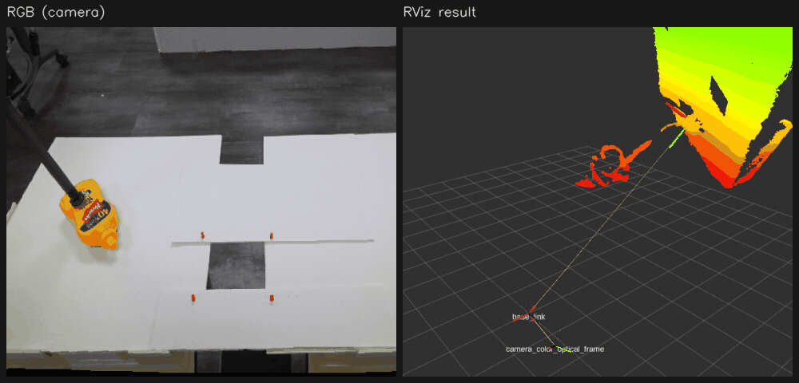
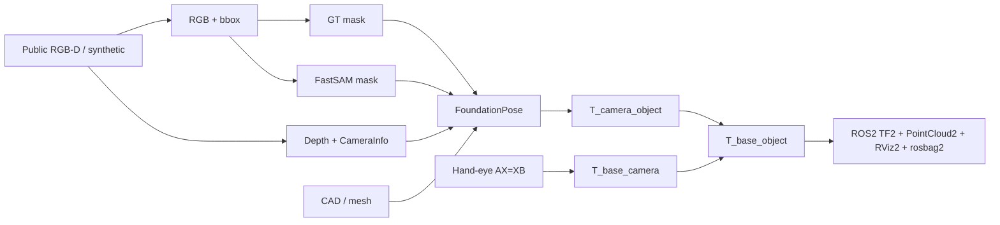

# RGB-D Robot 6D Pose Perception Pipeline



可验证的工程链路：公开 RGB-D → 掩膜 → FoundationPose 6D 位姿 → 手眼/坐标变换 → ROS2 离线回放。

```text
Camera calib → Detector bbox / FastSAM mask → FoundationPose (T_camera_object)
→ Hand-eye AX=XB → T_base_object = T_base_camera @ T_camera_object
→ ROS2 TF2 / PointCloud2 / RViz2 / rosbag2
```

**本仓库不包含：** PCL 滤波/平面/聚类、FK/IK、MoveIt2、真实机械臂联调。

## Highlights

| Item | Result |
|---|---|
| Chessboard calibration | mean reprojection ≈ **0.14 px** |
| FastSAM vs GT-mask pose (mustard0 frame) | ≈ **1.23° / 0.52 mm** (IoU ≈ 0.95) |
| YCB-V vs dataset GT (50 frames, mean) | rot 1.54°; trans 2.45 mm; **ADD-S 1.62 mm** |
| Hand-eye | noise ↑ → error ↑; more poses → error ↓ (**simulated** extrinsics) |
| ROS2 | Image / Depth / CameraInfo / cloud / pose / TF; dual entry (live + bag) |

Compact metrics: [`docs/results_summary.json`](docs/results_summary.json). Full experiment report: [`docs/PROJECT_REPORT.md`](docs/PROJECT_REPORT.md).

## Architecture



## Quick start

Regenerate the README GIF (synced RGB+RViz pairs, equal panels):

```powershell
# 1) In WSL: launch offline pipeline + rviz2, then:
#    python3 scripts/capture_synced_gif_frames.py --out outputs/ros2_acceptance/synced_gif --max-frames 40
# 2) On Windows:
python scripts\make_readme_gif.py `
  --synced-dir outputs\ros2_acceptance\synced_gif `
  --fps 5 --width 1000 --height 480
```

```powershell
# from repo root
conda activate <your-env>
$env:PYTHONPATH="$PWD\src"

python -m unittest discover -s tests -v
python scripts\run_core_demo.py

python scripts\calibrate_camera.py "data/calibration/opencv_left/*.jpg" --cols 7 --rows 6 --square-size 0.03
python scripts\undistort_preview.py --calibration outputs\camera_calibration.json --image data\calibration\opencv_left\left01.jpg

# optional: download large assets into data/ (gitignored)
python scripts\download_assets.py
python scripts\link_foundationpose_assets.py
python scripts\check_resources.py
```

## ROS2 offline replay (WSL2 + Jazzy)

See [`docs/ROS2_RUNBOOK.md`](docs/ROS2_RUNBOOK.md).

```bash
# from repo root on WSL, e.g. /mnt/<drive>/.../robot_perception_pipeline
source /opt/ros/jazzy/setup.bash
cd ros2_ws && colcon build --symlink-install && source install/setup.bash

ros2 launch robot_pose_pipeline_ros offline_pipeline.launch.py \
  manifest:=$(pwd)/../data/synthetic/manifest.jsonl \
  base_camera_pose:=$(pwd)/../data/synthetic/T_base_camera.txt

# with RViz config
rviz2 -d src/robot_pose_pipeline_ros/rviz/offline_pipeline.rviz
```

FoundationPose on cloud GPU: [`docs/CLOUD_FOUNDATIONPOSE.md`](docs/CLOUD_FOUNDATIONPOSE.md).

## Repository layout

```text
robot_perception_pipeline/
├─ src/robot_pose_pipeline/   # calib, transforms, hand-eye, metrics, RGB-D, synthetic
├─ scripts/                   # CLI entrypoints
├─ ros2_ws/                   # ROS2 offline replay package
├─ data/
│  ├─ calibration/            # chessboard samples (tracked)
│  ├─ synthetic/              # tiny synthetic demo (tracked)
│  ├─ models/                 # FastSAM weights (gitignored)
│  ├─ foundationpose/         # FP weights + demo_data (gitignored)
│  └─ datasets/               # optional YCB/BOP subsets (gitignored)
├─ outputs/                   # local run artifacts (gitignored)
├─ tests/
└─ docs/
```

## Documentation

| Doc | Purpose |
|---|---|
| [DOWNLOAD_CHECKLIST.md](docs/DOWNLOAD_CHECKLIST.md) | Asset download checklist |
| [ENVIRONMENT.md](docs/ENVIRONMENT.md) | Windows / WSL2 / Docker / ROS2 |
| [CLOUD_FOUNDATIONPOSE.md](docs/CLOUD_FOUNDATIONPOSE.md) | Cloud GPU FoundationPose notes |
| [RESOURCES.md](docs/RESOURCES.md) | External resources |
| [DATA_AND_CONVENTIONS.md](docs/DATA_AND_CONVENTIONS.md) | Frames & pose convention |
| [ROS2_RUNBOOK.md](docs/ROS2_RUNBOOK.md) | Build / launch / bag / RViz |
| [PROJECT_REPORT.md](docs/PROJECT_REPORT.md) | Experiment report |
| [results_summary.json](docs/results_summary.json) | Compact metrics |

## Known limitations

1. Hand-eye / `T_base_camera` are **simulated**, not real-robot calibration.  
2. Official mustard0 demo has **no annotated GT poses**; GT metrics use YCB-V.  
3. FastSAM experiment bbox is derived from GT mask (not an independent detector).  
4. FoundationPose was validated primarily on a **cloud RTX 4090**; laptop 6GB GPU is optional.  
5. Large bags, screenshots, and demo videos stay local under `outputs/` (gitignored).

## Acceptance checklist

1. Camera calibration JSON + undistort preview + reprojection error  
2. Hand-eye `AX=XB` (+ noise sweep)  
3. FoundationPose: GT mask → `T_camera_object`  
4. FastSAM vs GT-mask pose comparison  
5. `T_base_object = T_base_camera @ T_camera_object`  
6. ROS2 launch: Image / CameraInfo / PointCloud2 / Pose / TF / rosbag2 / RViz2  
